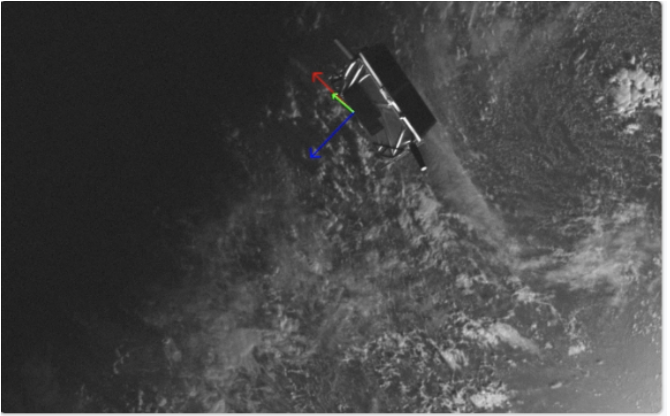

# Satellite Pose Estimation from Synthetic Imagery

## Project Overview

This project focuses on estimating the 6-DoF pose (position and orientation) of a satellite from synthetic imagery using computer vision. It utilizes the [SPEED+](https://zenodo.org/records/5588480) and [SPEED](https://zenodo.org/records/6327547) dataset, which contains rendered images of a satellite with corresponding ground truth pose information.

This project serves as a demonstration of applying computer vision and deep learning techniques to space-based applications. As an experiment I have tested different model architectures and training strategies to see how the model performs on the SPEED and SPEED+ dataset. This includes ResNet34 and EfficientNetV2-S with and without freezing early layers. The best performing model is the EfficientNetV2-S with freezing.

Loss is calculated as a weighted sum of the rotation and translation loss; train data is the synthetic dataset from SPEED and test data is the more real world lightbox dataset within the SPEED+ dataset. The results of the experiment can be seen below:


I have also included a UQ experiment that uses Monte Carlo Dropout to estimate the uncertainty of the pose estimation. This is done by adding a dropout layer (p=0.5) right before the final layer of the model. The dropout layer is kept active during inference and gathers 150 samples of the model's output to estimate the uncertainty of the pose estimation. The results of the UQ experiment can be seen below:


## Installation

1.  **Clone the repository:**
    ```bash
    git clone <your-repo-url>
    cd SatellitePoseEstimation
    ```
2.  **Set up a Python environment:**
    ```bash
    python -m venv venv
    source venv/bin/activate
    ```
3.  **Install dependencies:**
    ```bash
    pip install -r requirements.txt
    ```

4.  **Download the SPEED dataset:** Obtain the dataset from the links above (Make sure to remember the relevant paths to set in the `run_experiments.py` script).


## Usage

### Running The Experiments (`run_experiments.py`)

The `run_experiments.py` script automates training a predefined set of four model configurations (EfficientNetV2-S and ResNet34, with and without freezing early layers).

**Example:**

```bash
python run_experiments.py --base-output-dir ./all_experiment_runs
```

In order to run the UQ experiment, you can add the `--UQ` flag to the `run_experiments.py` script.

```bash
python run_experiments.py --base-output-dir ./all_experiment_runs_UQ --UQ
```


### Comparing Model Performances (`compare_models.py`)

After running the experiments, use `compare_models.py` to generate bar plots comparing their final test set performance.

**Example:**

```bash
python compare_models.py --model-dirs ../experiment_results/EffNet_Freeze ../experiment_results/EffNet_NoFreeze ../experiment_results/ResNet34_Freeze ../experiment_results/ResNet34_NoFreeze
    --output-plot-dir ../plots
```
## Visual Inference Demo with 3D Model Deployment

I have created a frontend demo that allows you to interact with the model to overlay the pose estimation predictions on an image and combine it with an image to 3D model as a proof of concept for how the model can be used in a real-world application to visualize the pose and intent of a satellite.

Example output image from the demo:



Video of the demo:


To run the demo, you must first setup huggingface cli and get access to the model weights as described in the [Stable Fast 3D Github Repo](https://github.com/Stability-AI/stable-fast-3d). You must also install the corresponding dependencies for the demo with the following commands:

Update setuptools by running:
```bash
pip install -U setuptools==69.5.1
```

Install wheel by running:
```bash
pip install wheel
```

Install the dependencies in the `stable_fast_requirements.txt` file by running:
```bash

pip install -r stable_fast_requirements.txt
```

Once you have access to the model weights, you can set the fine tuned model path in the environment variable `MODEL_PATH` and run the demo with the following command:

```bash
cd app
python app.py
```
You should now be able to see the demo at `http://localhost:4000`


## Resources

- [SPEED+](https://zenodo.org/records/5588480)
- [SPEED](https://zenodo.org/records/6327547)
- [Stable Fast 3D](https://github.com/Stability-AI/stable-fast-3d)
- [PVNet Research Paper](https://ieeexplore.ieee.org/document/9309178)
- [UQ Exploration](https://medium.com/@ciaranbench/monte-carlo-dropout-a-practical-guide-4b4dc18014b5)
- [Resnet34 Docs](https://docs.pytorch.org/vision/main/models/generated/torchvision.models.resnet34.html)
- [EfficientNetV2 Docs](https://docs.pytorch.org/vision/main/models/generated/torchvision.models.efficientnet_v2_s.html)
- [Boolean ArgPars](https://stackoverflow.com/questions/15008758/parsing-boolean-values-with-argparse)
